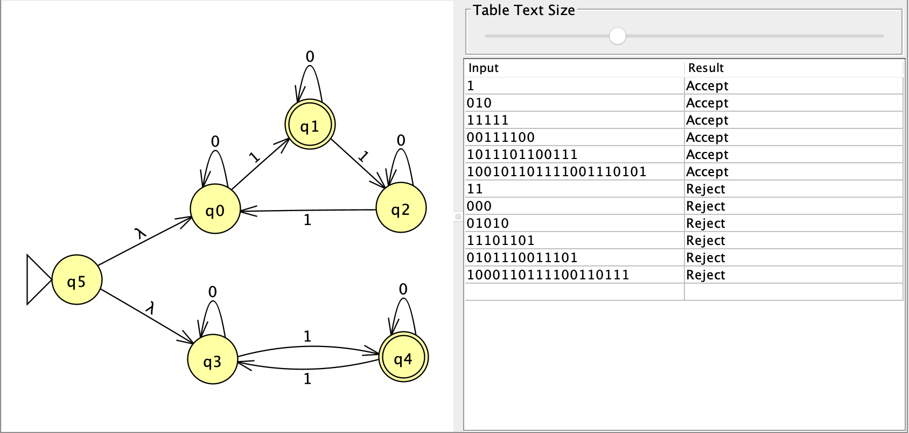
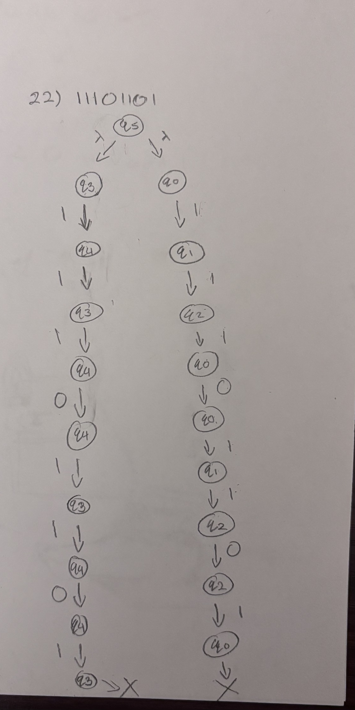
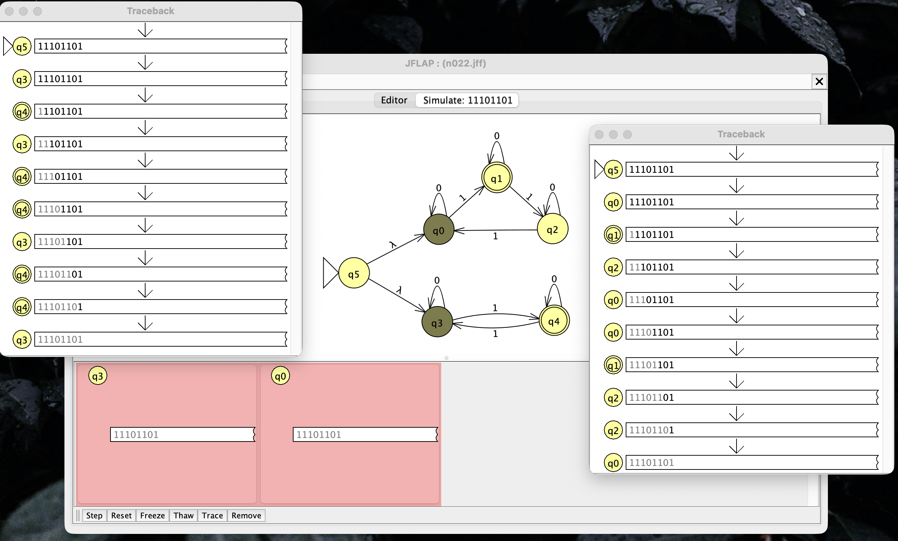

### Screenshot of NFA + Test Strings

### Step-by-State of 11101101
This was the only question where I had a slight problem with. I made the NFA without really thinking about the OR part. So it ended with the transitions overlapping with each other and overall just making it very confusing. I simply added the epsilon so that it is more clearly taking two possible paths (OR).

